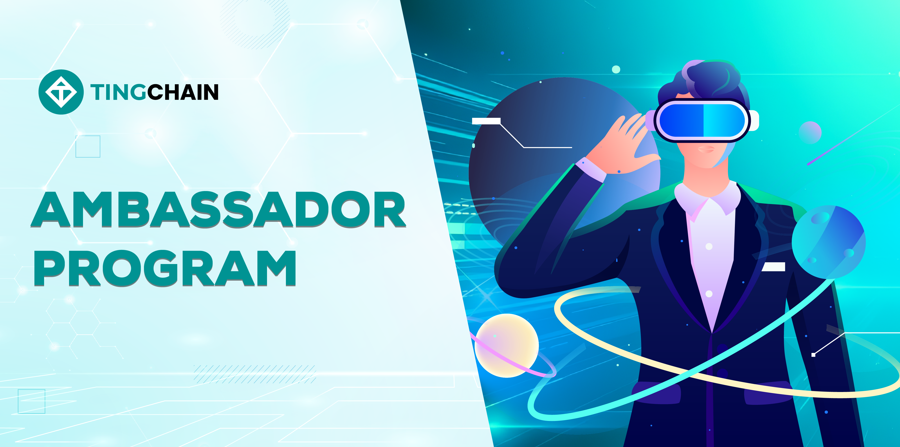

# Ambassador Program

<figure><figcaption></figcaption></figure>

**TingChain Ambassador Program !**

We are proud to introduce the TingChain Ambassador Program, where you can play a key role in growing and expanding the TingChain ecosystem. This is your chance to contribute, build a strong community, and earn exciting rewards!

**Why Become a TingChain Ambassador?** \
✅ Make an Impact: Help expand the community and raise awareness about TingChain. \
✅ Earn Rewards: Get rewarded for participating in tasks, events, and community activities. \
✅ Early Access: Gain exclusive insights into updates, products, and events. \
✅ Network & Learn: Connect with blockchain enthusiasts and industry experts.

Who Can Join? We are looking for passionate individuals who love blockchain technology, have strong communication skills, create engaging content, or have influence in the crypto community.

**Ambassador Responsibilities** \
🌍 Spread Awareness: Share news, resources, and updates about TingChain. \
📝 Create Content: Write blogs, make videos, or post on social media. \
🎤 Host Events: Support AMAs, meetups, and community discussions. \
💡 Provide Feedback: Help improve the TingChain ecosystem with valuable insights.

**How to Join** \
1️⃣ Apply through the : [https://forms.gle/mBViZTcpBtYwR6mL9](https://forms.gle/mBViZTcpBtYwR6mL9) \
2️⃣ Wait for approval from the TingChain team. \
3️⃣ Start your journey as a TingChain Ambassador and contribute to the community!

The TingChain Ambassador Program is your chance to showcase your creativity, passion, and leadership in the blockchain space. Join us today!

📢 Follow us for the latest updates!
